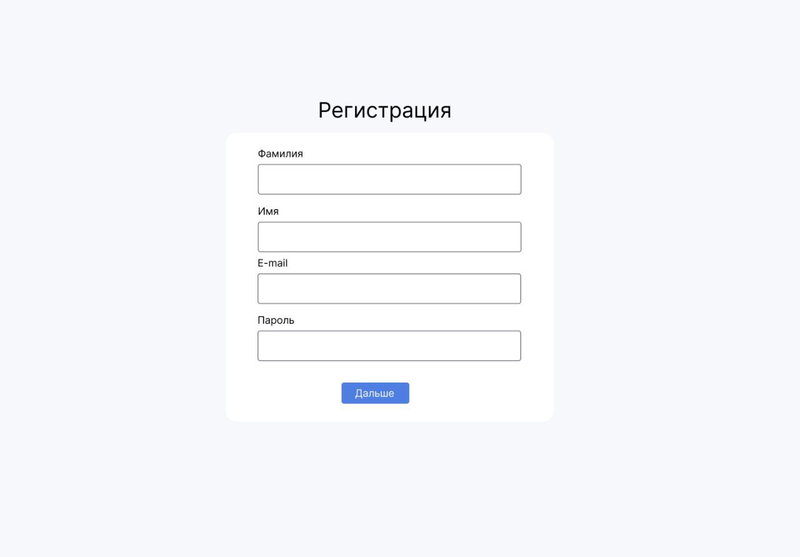
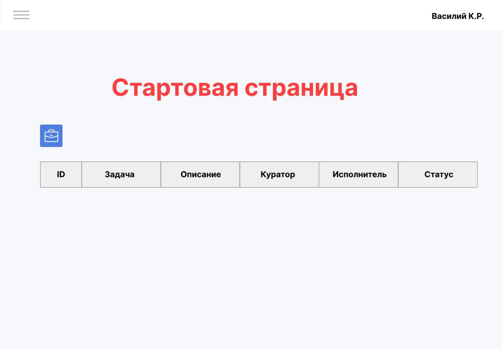
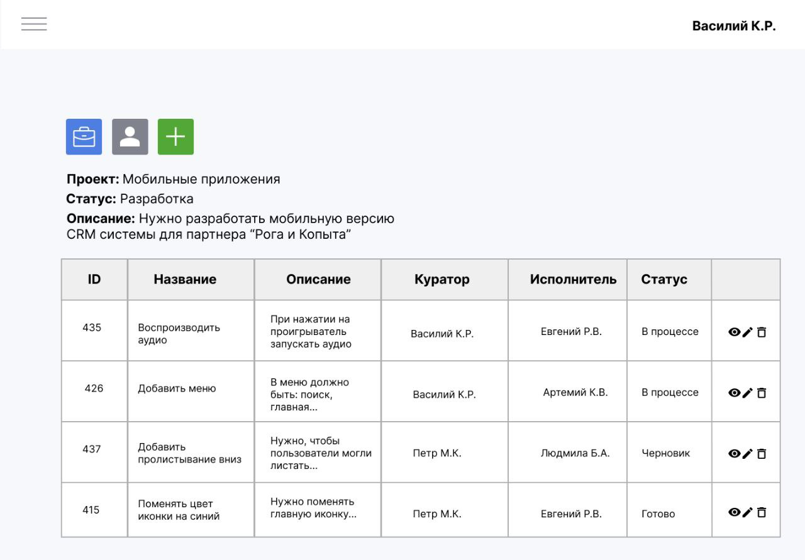
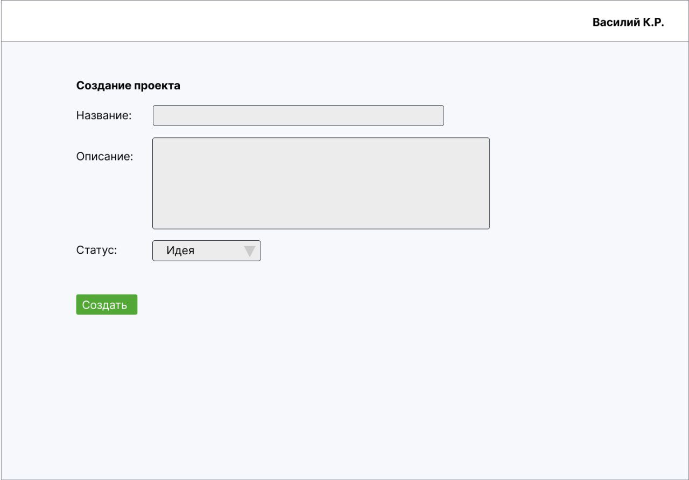
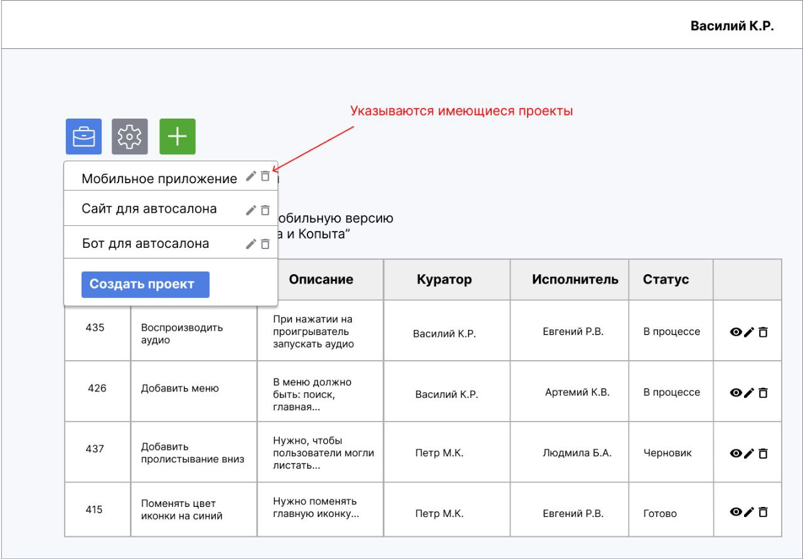
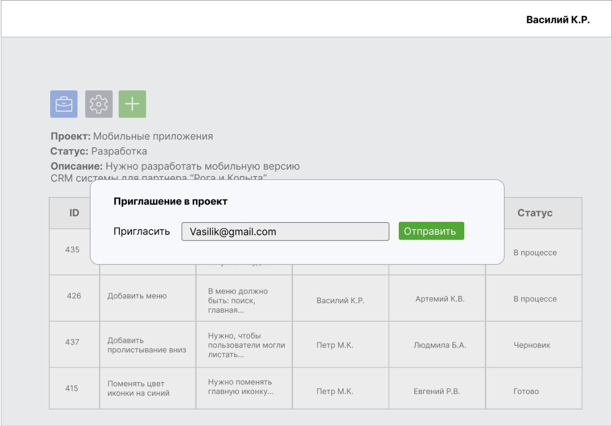
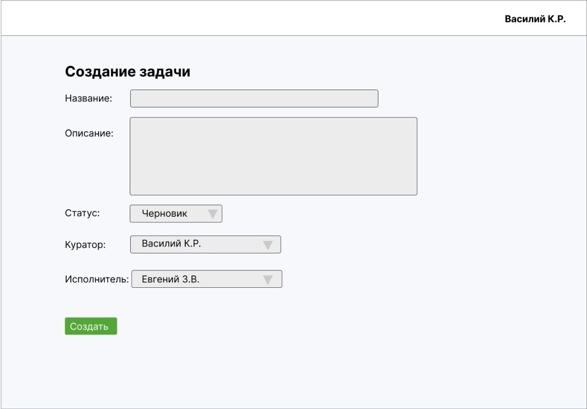
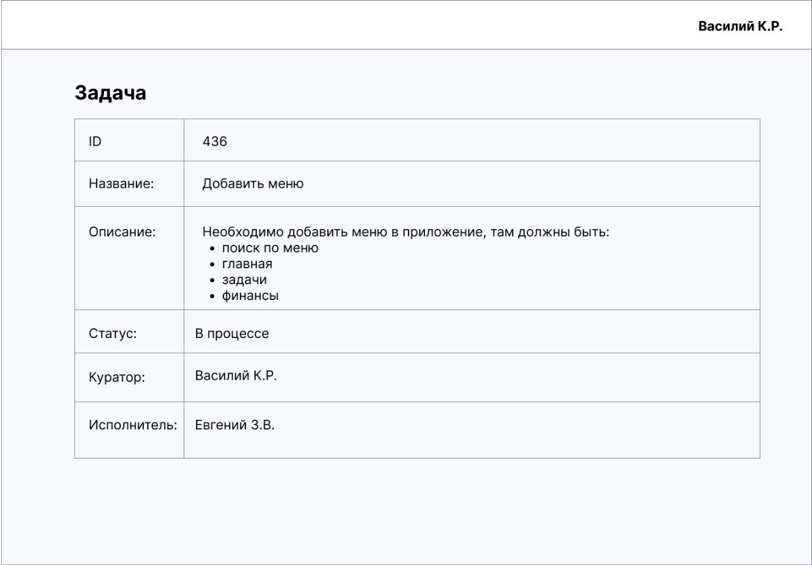

### Система задач

Необходимо реализовать небольшую систему задач с проектами:

1. Сначала пользователь должен пройти регистрацию в системе, введя: Фамилия, Имя, Почта, Пароль.
2. После авторизации/регистрации выходит стартовая страница, где пользователь нажав на синюю иконку с портфелем может нажать на кнопку «Создать проект».
3. При нажатии на «Создать проект» пользователю выходит отдельная страница, где он может ввести следующие данные: Название, Описание, Статус (Идея, Разработка, Готово) и кнопка «Создать».
4. Нажав на кнопку «Создать», пользователя перекидывает на главную страницу, где появляются иконки: Серая с человеком, где можно отправить приглашение в проект. Зеленая с плюсом, при нажатии можно будет создать задачу. Синяя с портфелем, где будут указаны имеющиеся проекты. Ниже кнопок появляется название, описание и статус проекта, в зависимости от того, какой проект выбрали.
5. Нажимая иконку с человеком, выходит модальное окно, где вводится почта нового пользователя, которого хотят пригласить в проект и кнопка «Отправить».
6. Новому пользователю приходит письмо на почту с предложением присоединиться к проекту. Если пользователь еще не зарегистрирован, то при переходе по ссылке выходит страница регистрации, только без поля «E-mail». Если пользователь уже зарегистрирован, то выходит страница с выбором, где он сможет принять, либо отклонить приглашение. Если пользователь принимает приглашение в проект, то его должно перекинуть на страницу с проектом. Если пользователь отклоняет приглашение, то перекидывать на главную страницу.
7. При нажатии на зеленую иконку с плюсом выходит отдельная страница с возможностью прописать: Название задачи, Описание, Статус (Черновик, В очереди, В процессе, Тестирование, Готово), Куратор, Исполнитель. В полях: Куратор и Исполнитель - пользователь может выбирать только тех, кто приглашен в проект. И кнопка «Создать».
8. Нажимая кнопку «Создать» выходит сформированная карточка задачи с введенной информацией.
9. В превью таблице с задачами должны быть столбцы: ID, Название задачи, Описание (Показывать первые 50 символов описания), Куратор, Исполнитель, Активные действия - здесь должны быть иконки глаза (При нажатии открывается карточка задачи), карандаша (Возможность изменить задачу) и корзины (Удалить задачу).
10. Создатель проекта также может изменять и удалять проекты, нажимая на соответствующие иконки в кнопке «Портфель».

> Каждый пользователь проходя авторизацию/регистрацию может создавать неограниченное кол-во проектов.

> Создатель проекта и только он, может редактировать информацию о проекте, удалять проект, приглашать в проект других пользователей по электронной почте, так-же удалять участников из проекта.

1. Авторизация и Регистрация пользователей с сохранением в базу данных.

2. Реализовать таблицу в базе данных и CRUD контроллер - "Проекты".
   - name (Название проекта)
   - description (Описание проекта)
   - status (Статус проекта, можно будет выбрать один из вариантов: Идея, Разработка, Готово)
   - created_at (Дата и время создания, timestamp)
   - updated_at (Дата и время обновления, timestamp)
   - created_by (Кто создал, id пользователя)
   - updated_by (Кто обновил, id пользователя)

3. Реализовать таблицу в базе данных и CRUD контроллер - "Участники проектов".
   - project_id (Проект, id проекта из таблицы "Проекты")
   - user_id (Пользователь, id пользователя, кого пригласили в проект)
   - invited_id (Пользователь, id пользователя, кто пригласил в проект)
   - created_at (Дата и время создания, timestamp)
   - updated_at (Дата и время обновления, timestamp)
   - created_by (Кто создал, id пользователя)
   - updated_by (Кто обновил, id пользователя)

4. Реализовать таблицу в базе данных и CRUD контроллер - "Задачи".
   - project_id (Проект, id проекта где была создана задача)
   - name (Наименование задачи)
   - description (Описание задачи)
   - executor_id (Участник, id участника, кто будет выполнять задачу)
   - curator_id (Участник, id участника, кто куратор задачи)
   - status (Статус задачи, можно будет выбрать один из вариантов: Черновик, В очереди, В процессе, Тестирование, Готово)
   - created_at (Дата и время создания, timestamp)
   - updated_at (Дата и время обновления, timestamp)
   - created_by (Кто создал, id пользователя)
   - updated_by (Кто обновил, id пользователя)

5. Реализовать таблицу в базе данных - "Приглашения", тут должны хранятся отправленные приглашения в проект.
   - project_id (Проект, id проекта)
   - user_id (Пользователь, id пользователя, кого пригласили в проект)
   - invited_id (Пользователь, id пользователя, кто пригласил в проект)
   - hash (Случайная строка, это хэш значение, которое будет отправлять вместе со ссылкой на почту, чтобы могли принять приглашение)
   - status (Статус, можно будет выбрать один из вариантов: Принят, Отклонен, Отправлен)
   - created_at (Дата и время создания, timestamp)
   - updated_at (Дата и время обновления, timestamp)
   - created_by (Кто создал, id пользователя)
   - updated_by (Кто обновил, id пользователя)

> Поля для каждой таблицы указаны примерно, вы можете добавлять новые поля/редактировать существующие, возможно доработать.

Визуальные указания прикрепили, также если на файле написано что-то красным цветом - это лишь пояснения от продукт-менеджера, их писать в реализации не нужно

Фреймворк Yii2 (https://www.yiiframework.com/)
